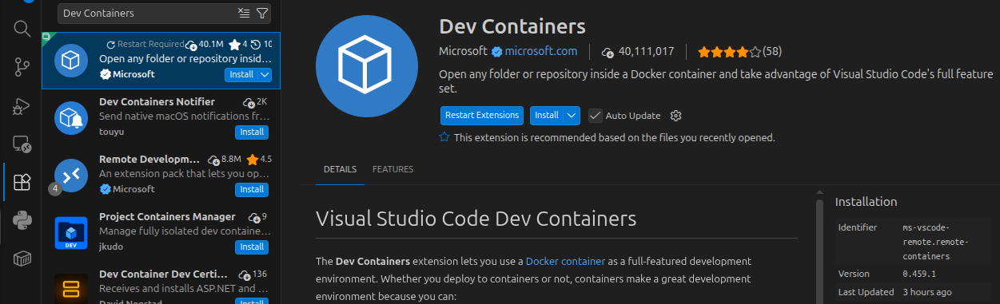
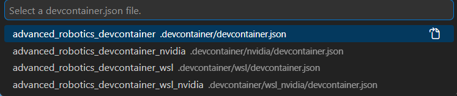
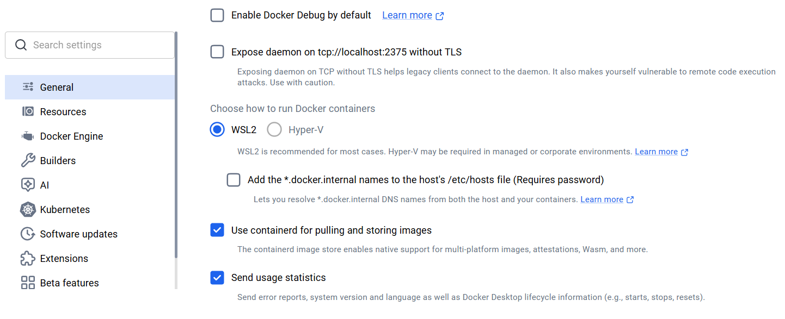
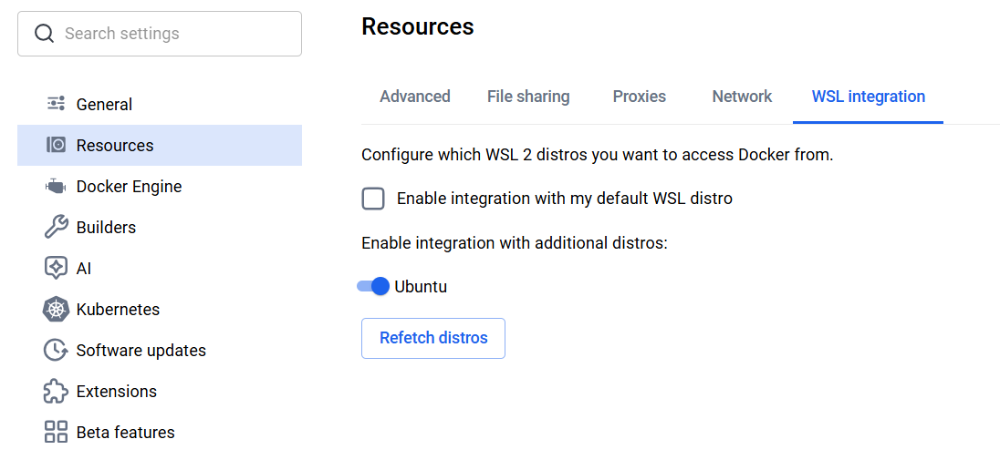
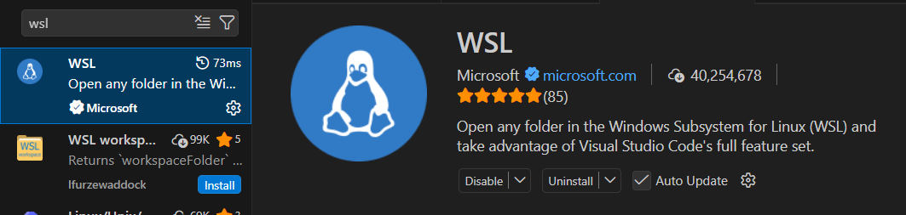

# ROBO.720 Exercises

This repository includes the exercises for ROBO.720 Advanced Robotics course autumn 2026 implementation. Below are instructions for making the exercises work with Ubuntu and Windows in Docker container environment. Follow the one based on which OS you are using.

## 1. Ubuntu

### Getting started

To install Docker on your machine, follow [these instructions](https://docs.docker.com/engine/install/ubuntu/). You also need to install Docker compose plugin using [these instructions](https://docs.docker.com/compose/install/linux/).

It is easiest to code and run the exercises in VS Code. You can install VS Code by following [these instructions](https://code.visualstudio.com/docs/setup/linux) or by installing it from App Center.

### Nvidia prerequisites

If you do not have Nvidia GPU on your machine, you can skip this part.

For Gazebo rendering to work with Nvidia GPUs, Docker needs access to them. For that, we need to install Nvidia Container Toolkit. Follow [these instructions](https://docs.nvidia.com/datacenter/cloud-native/container-toolkit/latest/install-guide.html) until 'Configuring Docker' header. No need to care about the 'Rootless Mode' subheader.

### Configuring Docker

For native Ubuntu, Docker cannot open windows on your display by default. Every time you login to your machine, you need to give Docker access to this functionality by running the following in your terminal:

```bash
xhost +local:docker
```

This can be automated by adding it in your ```~/.bashrc```:

```bash
echo "xhost +local:docker" >> ~/.bashrc
```

Depending on how you have installed Docker, your user might not have permission to run Docker commands. To give your user access to Docker commands, run the command below. If your user already has permission to run Docker, this command will do nothing:

```bash
sudo groupadd docker && sudo usermod -aG docker $USER && newgrp docker
```

### Configuring VS Code

First, you need to install Dev Containers extension in VS Code. To do this, press **Extensions** tab in VS Code left tool bar (also opens with **Ctrl+Shift+X**), then type 'Dev Containers' in the search bar, and choose the extension by Microsoft. Then press 'Install'.



### Cloning the repository

To acquire the exercise code, first clone the repository to a desired directory on your machine:

```bash
cd ~/
mkdir desired_directory_name/
cd desired_directory_name/
git clone https://github.com/tau-alma/robo720_2026.git
```

This will clone the course repository as a subdirectory in the desired directory.

### Running the container

To run the container in VS Code, open VS Code in the repository directory:

```bash
cd ~/desired_directory_name/robo720_2026
code .
```

Once in VS Code, open Command Palette by pressing **Ctrl+Shift+P**, and type in 'Dev Containers: Rebuild and Reopen in Container'. This should prompt you with the following pop-up:



If your machine has an Nvidia GPU, choose `advanced_robotics_devcontainer_nvidia`, otherwise choose `advanced_robotics_devcontainer`.

After that, VS Code will open in the Docker container. The first build might take 5-10 minutes. If a terminal does not open automatically after building, you can open one from the toolbar on top of the window by pressing 'Terminal', and then 'New terminal'. This opens a bash shell which is identical by its functionalities to a default terminal on Ubuntu machines.

## 2. Windows

### Getting started

Install WSL 2 on your machine by following the [instructions](https://learn.microsoft.com/en-us/windows/wsl/install). Installation should come by default with a Ubuntu distro.

Next, install Docker Desktop on your machine from Microsoft Store or [here](https://docs.docker.com/desktop/setup/install/windows-install/). Then, open Docker Desktop application, navigate to 'Settings' (cog wheel in the toolbar), and from 'General' tab, make sure that 'Choose how to run Docker containers' is set to 'WSL2' and not 'Hyper-V'.



Then from 'Resources' tab, enable the integration with 'Ubuntu' distro.



Finally, press 'Apply' to save the changes.

It is easiest to code and run the exercises in VS Code. You can install VS Code by following [these instructions](https://code.visualstudio.com/docs/setup/windows).

### Configuring VS Code

First, you need to install Dev Containers extension in VS Code. To do this, press **Extensions** tab in VS Code left tool bar (also opens with **Ctrl+Shift+X**), then type 'Dev Containers' in the search bar, and choose the extension by Microsoft. Then press 'Install'.


Next, install also 'WSL' extension to your VS Code. To do this, type 'WSL' in **Extensions** tab search bar, and choose the extension by Microsoft. Then press 'Install'.



### Nvidia prerequisites

If you do not have Nvidia GPU on your machine, you can skip this part.

It is sufficient that you have Nvidia drivers installed on your machine. It is possible that hardware rendering of Gazebo does not work with older drivers. In this case you can try to upgrade your driver version.

### Cloning the repository

To run the exercise codes, first clone the repository to a desired directory in WSL terminal. Do not clone into the default directory `/mnt/c/...`, but instead to a desired directory inside home directory (`~/`):

```bash
cd ~/
mkdir desired_directory_name/
cd desired_directory_name/
git clone https://github.com/tau-alma/robo720_2026.git
```

### Running the container

Next, open VS Code in `robo720_2026` directory. You can do this from WSL Ubuntu terminal with:

```bash
cd ~/path/to/robo720_2026
code .
```

Then, open Command Palette by pressing **Ctrl+Shift+P**, and type in 'Dev Containers: Rebuild and Reopen in Container'. This should prompt you with the following pop-up:


If your machine has an Nvidia GPU, choose `advanced_robotics_devcontainer_wsl_nvidia`, otherwise choose `advanced_robotics_devcontainer_wsl`.

After that, VS Code will open in the Docker container. The first build might take 5-10 minutes. If a terminal does not open automatically after building, you can open one from the toolbar on top of the window by pressing 'Terminal', and then 'New terminal'. This opens a bash shell which is identical by its functionalities to a default terminal on Ubuntu machines.

## Workflow

The idea is that you code your exercises in VS Code which is inside the container, so all the required packages are installed there. Then you can run the code in the VS Code terminal, like you would in Ubuntu terminal.
